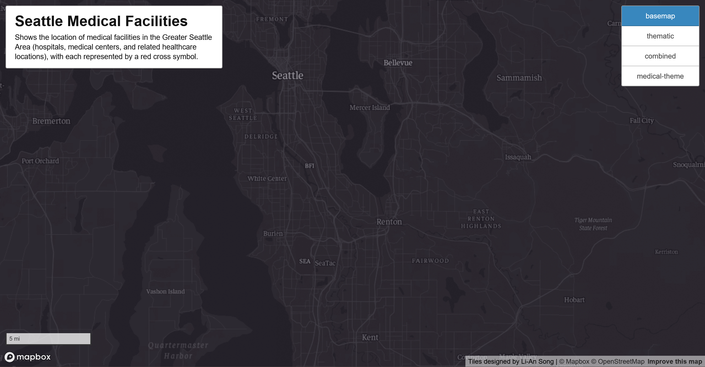
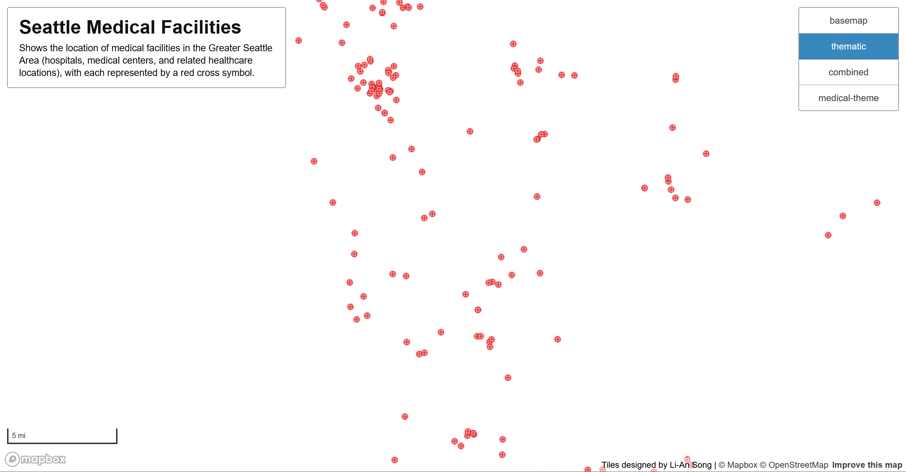
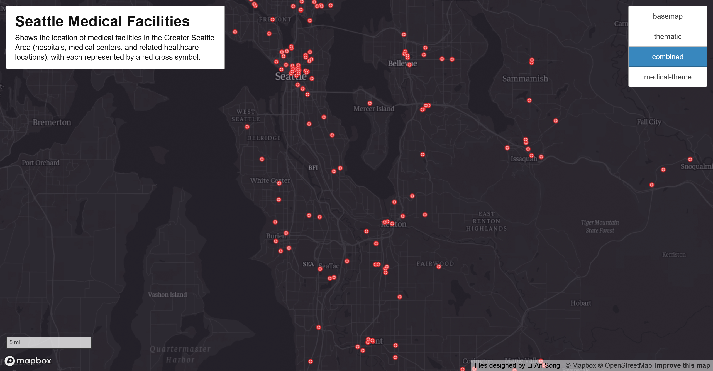
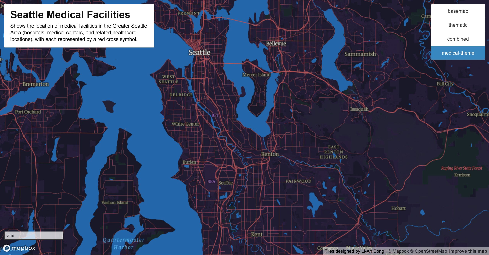

# Seattle Medical Facilities Web Map

  
AI Disclosure

    No AI tools were used in this assignment.

---

## Project Overview

This project presents an interactive web map visualizing medical facilities in the Greater Seattle Area, including hospitals, medical centers, clinics, and related healthcare locations. Facilities are represented using red cross symbols and can be explored across multiple custom-designed raster tile sets.

The map is built using Mapbox GL JS and allows users to toggle between four different tile sets to compare visual styles and thematic emphasis. The web map can be explored [here](https://latw12345.github.io/sea-medical-facilities-web-map/).

---

## Area Examined

The map focuses on the Greater Seattle Area, covering the city of Seattle and surrounding regions where medical facilities are concentrated. The approximate bounding box of the study area is:

- **West:** -123.000  
- **East:** -121.500  
- **South:** 47.250  
- **North:** 47.825  

This extent ensures coverage of major healthcare infrastructure while maintaining a focused regional scale.

---

## Zoom Levels

All tile sets are designed to be viewed within the same zoom range to maintain visual consistency and avoid empty or overscaled tiles:

| Tile Set | Minimum Zoom | Maximum Zoom |
|--------|-------------|--------------|
| Basemap | 11 | 15 |
| Thematic | 11 | 15 |
| Combined | 11 | 15 |
| Medical Theme | 11 | 15 |

User interaction is constrained to these zoom levels within the map interface.

---

## Tile Sets and Screenshots

### 1. Basemap Tile Set

This tile set presents a dark, monochrome basemap derived from Mapbox’s base style, lightly customized with a subtle purple tint. It provides essential geographic context, including land, water, transportation networks, and administrative boundaries, while maintaining a muted visual hierarchy. The slight purple tone evokes a nighttime atmosphere, offering visual cohesion without competing with overlaid thematic data. This makes the basemap an effective neutral reference layer that supports additional map elements.

### 2. Thematic Tile Set

This tile set emphasizes the spatial distribution of medical facilities across the Greater Seattle area using point data only, with no underlying basemap or contextual layers. Hospital and healthcare locations are sourced from [King County Open Data](https://gis-kingcounty.opendata.arcgis.com/datasets/5da0fe8cdaf04826ae56029bb6014b94/explore?location=47.488762%2C-122.117742%2C9), ensuring authoritative and up-to-date information. By isolating only the medical facility points, viewers can clearly observe spatial patterns, clustering, and relative density across the region without visual distraction.

### 3. Combined Tile Set

This tile set merges the monochrome basemap from Tile Set 1 with the medical facility points from Tile Set 2. The dark basemap provides geographic context while the red medical symbols remain visually prominent. By combining base and thematic layers, this map allows users to understand the spatial relationship between healthcare locations and the surrounding urban environment, transportation networks, and water features.

### 4. Medical Theme Tile Set

This tile set is a fully designed Mapbox style that embodies a dark, medical-themed “night city” aesthetic. Inspired by concepts of health and vitality, the map uses muted reds for transportation features, deep blues for water, and dark neutral tones for land and structures. Labels, roads, and built features are styled cohesively to maintain readability while reinforcing the medical theme. Designed as a standalone thematic basemap, this tile set visually integrates healthcare symbolism into the overall urban landscape.

---